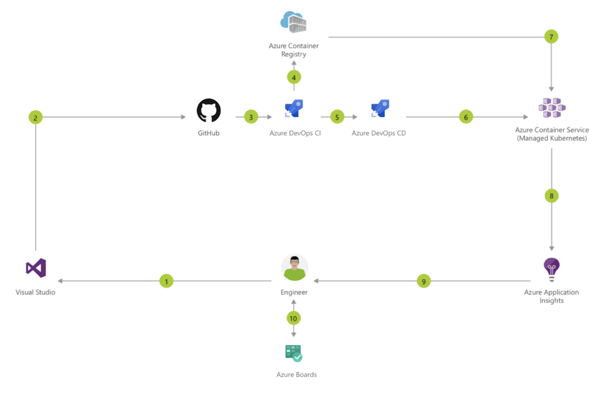
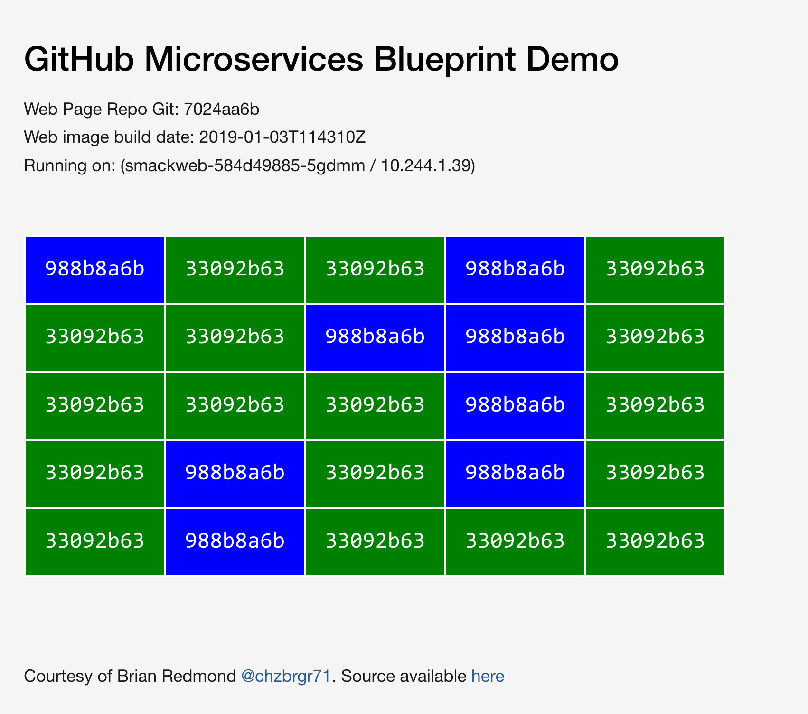

[](https://dev.azure.com/pierluigi-github/github-azure-microservices-blueprint/_build/latest?definitionId=3?branchName=master)

# GitHub + Azure “microservices” Baseline Blueprint 
An all-purpose microservices blueprint to kickstart a successful DevOps workflow on Azure accompanying our [associated partner program that can be taken to market for the purposes of lead generation in this space](https://docs.google.com/document/d/1jmaa6zpGj9I8CI4ENKDcsORC-YmxGIl1ar9UYZ_iLEE/edit#).

This repository contains instructions for partners willing to utilize our baseline blueprint to kickstart the creation of bespoke solutions based on GitHub, Azure, Docker (ACR), Kubernetes (AKS) as well being connected to an Azure DevOps project with a CI/CD pipeline to illustrate a blue/green strategy for microservice architectures.

- [Public URL of the `smackweb` service](http://168.61.161.70/)
- [Azure DevOps Project](https://dev.azure.com/pierluigi-github/github-azure-microservices-blueprint)

⚠️ **Please note**: To save on Azure billing costs the VMs may occasionally be in the Stopped state. This will be solved once this project is moved to an organization level account (see [TODOs](https://github.com/githubpartners/github-azure-microservices-blueprint#additional-work)).

# Business Value Proposition

The “microservices” blueprint helps our partners visualize what a modern development workflow looks like and how it could be implemented in organizations at scale, using a baseline definition that can be expanded as needed depending on specific requirements. For more info about the business value proposition, please refer to the [Partner Program](https://docs.google.com/document/d/1jmaa6zpGj9I8CI4ENKDcsORC-YmxGIl1ar9UYZ_iLEE/edit#) document.

# Blueprint Description

The goal of this baseline blueprint is to illustrate how teams can collaborate efficiently on different microservice repositories on GitHub and go from pull request to production with guaranteed zero downtime thanks to a blue/green deployment strategy.

Azure Boards allows project managers and collaborators to leverage an agile workflow while tracking all work items for regulatory purposes. The tight integration offered by the AKS managed K8S solution simplifies the deployment and operations of a Kubernetes based “service mesh” and enables teams to dynamically scale the application infrastructure with confidence and agility.




Key components and their respective implementation status:

| Component | Scope | Status |
| --- | --- | --- |
|GitHub | CI/CD, Pull Request checks, Branch Protection | 🔶 |
| Azure DevOps | Build, Push to private registry (ACR), Release via blue/green strategy (AKS) | ✅ |
| Azure Kubernetes Service | Manually configured cluster with instructions | ✅ |
| Azure Kubernetes Service | Automatic provisionin via ARM or Terraform | 🔴 |
| Azure Boards | Project Management and GitHub integration with Work Items, Releases, Commits | 🔶 |
| Azure Application Insights| Monitoring and metrics-based gated rollouts | 🔴 |

Legend: ✅ = Done, 🔶 = WIP, 🔴 = TODO

**Please note** The deployed instance is presently hosted on the personal Azure account of https://github.com/pierluigi. 

## Blue/Green and Canary Deployments with Azure DevOps, Istio and AKS

Follow this guide to implement a blue/green deployment strategy using Azure Pipelines targeting a polyglot application deployed to an Azure Kubernetes Cluster using Helm. Istio is used to shape traffic to different versions of the same microservice giving full control on what your users see and controlling the flow of releases throughout the pipeline.

The web ui, currently located at http://168.61.161.70/ will show a table with the current Istio routing layout:



## Demo script

- Trigger a new release for the ["Reinstall Helm Chart" pipeline](https://dev.azure.com/pierluigi-github/github-azure-microservices-blueprint/_release?view=mine&definitionId=3)
- Wait and open http://168.61.161.70
- Verify blue/green cluster outline is ready
- Modify the backColor to "Purple" and wait for CI/CD to kick in
- Approve manually the [Blue/Green pipeline](https://dev.azure.com/pierluigi-github/github-azure-microservices-blueprint/_release?view=mine&definitionId=1)


### Deploy AKS and install Helm

Let's start by creating a resource group and provisioning our K8S cluster called `mesh` on AKS. On you Azure Cloud Shell:

```bash
az group create --location centralus --name aks
az aks create -g aks -n mesh -k 1.11.4
az aks get-credentials -g aks -n mesh

# deploy helm
kubectl create serviceaccount -n kube-system tiller; kubectl create clusterrolebinding tiller --clusterrole=cluster-admin --serviceaccount=kube-system:tiller; helm init --service-account tiller
```

### Install istio

Istio allows us to create a virtual service that will be our edge router/proxy capable of fanning out our traffic internally in the cluster based on the desired strategy (in our case a blue/green style deployment). By using its "sidecar injection" mechanisms, our services will be discovered and proxied automatically. For additional information refer to the official docs.

```bash
curl -L https://git.io/getLatestIstio | sh -
cd istio-1.0.3
kubectl apply -f install/kubernetes/helm/istio/templates/crds.yaml
kubectl apply -f install/kubernetes/istio-demo-auth.yaml

# Enable the automatic sidecar injector
kubectl label namespace default istio-injection=enabled

# Our pods will be in the Running/Completed state soon
kubectl get pods -n istio-system
kubectl get svc -n istio-system
```

### Create the private Azure Container Registry (ACR) to host our docker containers

Follow [the instructions](https://docs.microsoft.com/en-us/azure/container-registry/container-registry-get-started-portal) to create your private ACR and make sure to enable Admin user access. Note down the access keys for admin user in ACR Access Keys section of the portal.

⚠️ **Please note**: the following method is NOT a security best practice. We advise you read the official docs to understand the implications and that this is meant for experimentation and not for production use.

To ensure the docker connection can be established from AKS to the ACR, a docker-registry secret [needs to be definied](https://medium.com/@pjbgf/azure-kubernetes-service-aks-pulling-private-container-images-from-azure-container-registry-acr-9c3e0a0a13f2).

```bash
kubectl create secret docker-registry acrsecret --docker-server "<REGISTRY_NAME>.azurecr.io" --docker-username <USERNAME> --docker-password <PASSWORD>
```

Azure DevOps docs recommend to rename azure-pipelines.yml to azure-pipelines.acr.yml and update this in the devops build WEB UI setting pane (see https://docs.microsoft.com/en-us/azure/devops/pipelines/languages/docker?view=vsts&tabs=yaml).

### Create the Azure DevOps Release Pipeline

This Azure DevOps [Work Item](https://dev.azure.com/mseng/Azure%20DevOps%20Roadmap/_workitems/edit/1221170) tracks the progress of the release pipeline YAML definition support. Until that is ready, please refer to the pipelines defined in the [Azure DevOps project](https://dev.azure.com/pierluigi-github/github-azure-microservices-blueprint).


### Deploy all pods at once

To illustrsate the current setup we will perform a manual deployment. 
**Please note**: this requires the specified container tags as defined in the [smackweb.yaml](/manual-deploy/smackweb.yaml) and [smackapi.yaml](/manual-deploy/smackapi.yaml) files to exist in the ACR beforehand.

```bash
cd manual_deploy
kubectl apply -f .
```
### Verify web app is running

```bash
kubectl get svc -n istio-system
# Find the row corresponding to this:
# NAME                     TYPE           CLUSTER-IP     EXTERNAL-IP     PORT(S)
# {...}
# istio-ingressgateway     LoadBalancer   10.0.134.104   168.61.161.70   80:31380/TCP,443:31390/TCP,31400:31400/TCP,15011:30482/TCP,8060:30740/TCP,853:31204/TCP,15030:31704/TCP,15031:31097/TCP   38m
# {...}
# and paste the EXTERNAL_IP in your browser to load the web app's dashboard. 
# By default it shows a 50/50 Blue/green deployment

```

### Modify blue/green traffic routing

```yaml
# Modify the weights at the end of smackapi-vs.yaml
# ...
  http:
  - route:
    - destination:
        host: smackapi
        subset: blue
      weight: 100 # max out blue
    - destination:
        host: smackapi
        subset: green
      weight: 0 # zero out green
```

Now apply the updated template:

```bash
kubectl apply -f smackapi-vs.yaml
```

Reload the web app to see all blue nodes.

### Build an Azure DevOps Build definition

Create a project and a build pipeline connected to Github and point it to `azure-pipelines.yml`


## Optional

### Install istioctl on mac

```bash
brew tap ams0/istioctl
brew install istioctl
```

### Add a DNS entry for `istio-ingressgateway`

```bash
kubectl get svc istio-ingressgateway -n istio-system -o jsonpath='{.status.loadBalancer.ingress[0].ip}'
# Returns your IP
az network dns record-set a add-record -g dns -z <YOUR_FQDN> -n *.mesh --value <IP>
```


# Additional Work

TODO:
- [ ] Extract Azure DevOps project to githubpartners organization account
- [ ] Move ACR and AKS to the githubpartners org on Azure 

### Credits

Thanks to [Alessandro Vozza's WinOps 2018 talk](https://github.com/ams0/winops-london).


### Useful links

- [Smackapp source](https://github.com/chzbrgr71/microsmackv2)
- [Azure trials](aka.ms/aztrialsuk)
- [Istio](http://istio.io)
